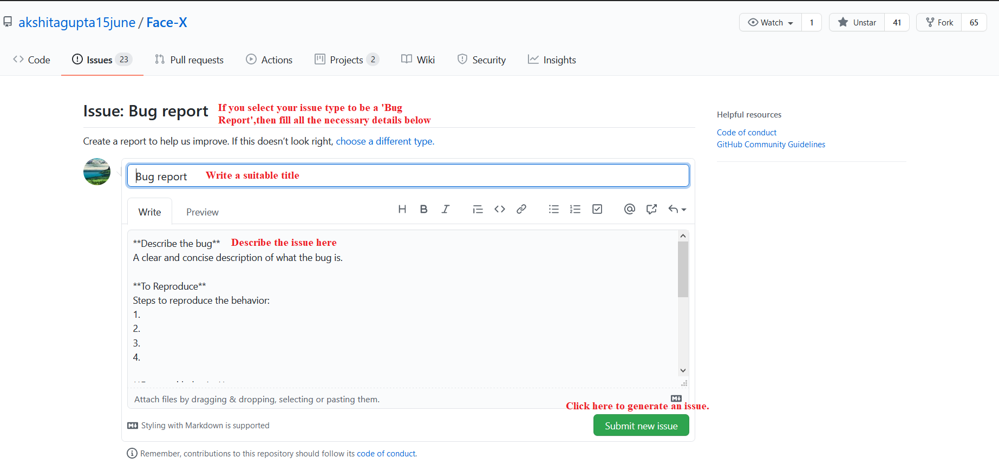
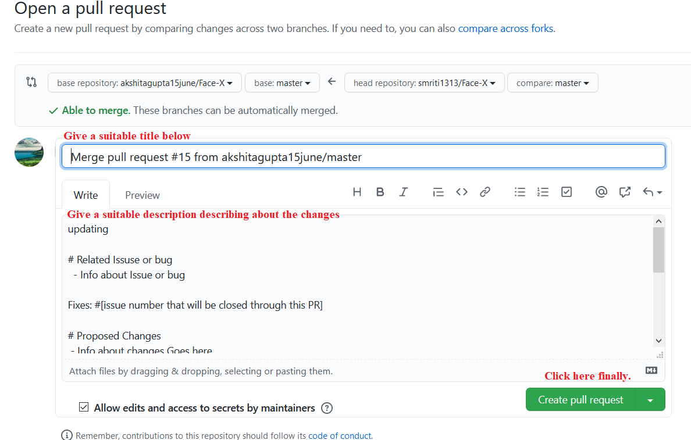

# Contributing Guidelines  

First time in open-source? Well, we got your back. This documentation has all the necessary details from where to begin with open-source contributions.
  
# Workflow👩‍💻👨‍💻  

Following are the guidelines that will help you to get an issue/problem statement to work on:
  
## Step 0 : Find an issue  🔍
- Take a look at the Existing Issues or create your **own** Issues! Click [here](https://github.com/akshitagupta15june/Face-X/issues) 



- Wait for the Issue to be assigned to you after which you can start working on it.  
- Note : Every change in this project should/must have an associated issue.   
  
## Step 1 : Fork the Project 🍴
- Fork this Repository. 

1. On GitHub, navigate [here](https://github.com/akshitagupta15june/Face-X)

2. In the top-right corner of the page, click Fork. 


## Step 2: Cloning the repo->creating a local copy

- Open terminal or windows powershell.

- Keep a reference to the original project in `upstream` remote.  
```bash  
$ git clone https://github.com/<your-username>/Face-x  
$ cd Face-X
$ git remote add upstream https://github.com/akshitagupta15june/Face-X
```  

- For further help with forking and updating the forked repo, read [here.](https://docs.github.com/en/github/getting-started-with-github/fork-a-repo#fork-an-example-repository)

## Step 2 : Branch  🔖

- Create a new branch. Use its name to identify the issue you are addressing.  
``` bash 
# It will create a new branch with name Branch_Name and switch to that branch 
$ git checkout -b Branch_name  
```  
- Watch [this](https://www.youtube.com/watch?v=OVQK2zzb6U8) video for better understanding about branching.

## Step 3 : Work on the issue assigned  📕
- Work on the issue(s) assigned to you.   
- Add all the files/folders needed.  
- After you've made changes to the project add changes to the branch you've just created by:  
``` bash 
# To add all new files to branch Branch_Name  
$ git add .  

# To add only a few files to Branch_Name
$ git add <some files>
```
  
## Step 4 : Commit  
- To commit give a descriptive message for the convenience of reviewer by:  
```bash
# This message get associated with all files you have changed  
$ git commit -m "message"  
```  

## Step 5 : Pushing changes to forked repo:  
- When your work is ready and complies with the project conventions, upload your changes to your fork:  
  
```bash  
# To push your work to your remote repository  
$ git push -u origin Branch_Name  
```  
- Watch [this](https://www.youtube.com/watch?v=ruieT3Nkg2M) to have a clear understaning about pushing changes to forked repo.
## Step 6 : Pull Request  🎣
- Go to your forked repository in browser.  

- Click on compare and pull requests.

- Then add a title and description to your pull request that explains your contributions.  

- Voila! Your Pull Request has been submitted and will be reviewed by the moderators🥳  
  
## Need more help?🤔  
You can refer to the following articles on basics of Git and Github in case you are stuck:  
- [Forking a Repo](https://help.github.com/en/github/getting-started-with-github/fork-a-repo)  
- [Cloning a Repo](https://help.github.com/en/desktop/contributing-to-projects/creating-an-issue-or-pull-request)  
- [How to create a Pull Request](https://opensource.com/article/19/7/create-pull-request-github)  
- [Getting started with Git and GitHub](https://towardsdatascience.com/getting-started-with-git-and-github-6fcd0f2d4ac6)  
- [Learn GitHub from Scratch](https://lab.github.com/githubtraining/introduction-to-github)  
- [Branching with interactive mode](https://learngitbranching.js.org/)
  
## Tip from us😇  

**No contribution is too small and its never too late to start.**